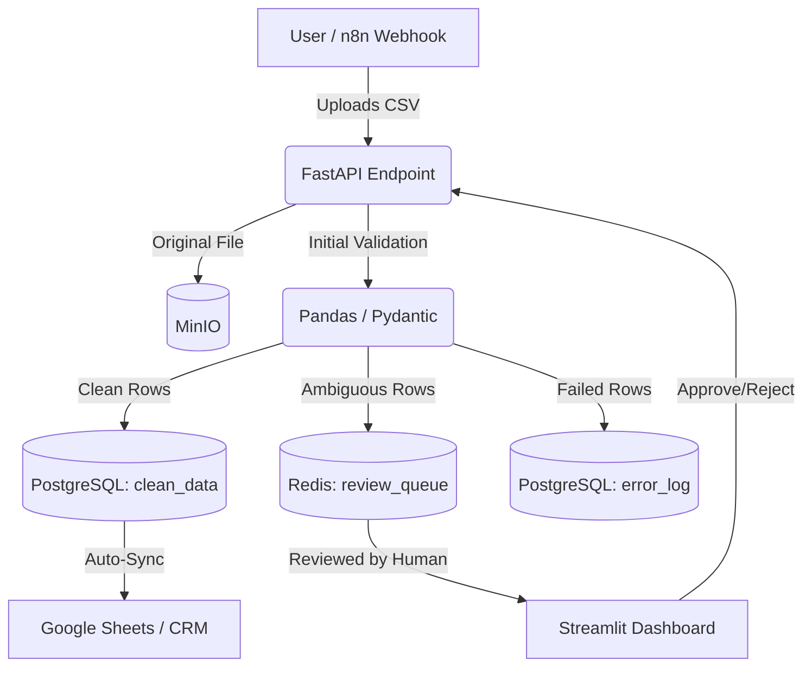

# Project: Smart Data Intake Pipeline

## 1. Problem Statement
Business data intake is often messy and error-prone. Ingesting CSV/Excel files for CRM migration, customer onboarding, or supplier registration often results in bad data entering core systems. This project is a complete intake-to-reviewed-output pipeline that validates, cleanses, and stages data, ensuring only high-quality data reaches the final destination (CRM, Google Sheets) while flagging ambiguous or invalid records for human review.

## 2. Architecture



*Note on Streamlit:* The Streamlit Dashboard does not access the Redis cache or PostgreSQL database directly. Instead, it interacts exclusively with FastAPI endpoints for review operations, keeping the architecture decoupled.

## 3. Tech Stack
- **Orchestrator:** n8n
- **Backend:** FastAPI, Pandas, Pydantic
- **Database:** PostgreSQL (main DB + audit log)
- **Cache/Queue:** Redis (review queue)
- **Object Storage:** MinIO (file storage for originals)
- **Frontend Dashboard:** Streamlit
- **Infrastructure:** Docker Compose

## 4. Database Schema

```sql
CREATE TABLE uploads (
    upload_id UUID PRIMARY KEY DEFAULT gen_random_uuid(),
    filename VARCHAR(255) NOT NULL,
    status VARCHAR(50) DEFAULT 'processing',
    total_rows INT,
    created_at TIMESTAMP DEFAULT CURRENT_TIMESTAMP
);

CREATE TABLE clean_data (
    record_id UUID PRIMARY KEY DEFAULT gen_random_uuid(),
    upload_id UUID REFERENCES uploads(upload_id) ON DELETE CASCADE,
    line_number INTEGER,
    first_name VARCHAR(100),
    last_name VARCHAR(100),
    email VARCHAR(255),
    phone VARCHAR(50),
    company VARCHAR(255),
    processed_at TIMESTAMP DEFAULT CURRENT_TIMESTAMP,
    UNIQUE(upload_id, email)
);

CREATE TABLE error_log (
    error_id UUID PRIMARY KEY DEFAULT gen_random_uuid(),
    upload_id UUID REFERENCES uploads(upload_id) ON DELETE CASCADE,
    line_number INTEGER,
    row_data JSONB,
    error_reason TEXT,
    created_at TIMESTAMP DEFAULT CURRENT_TIMESTAMP
);

CREATE INDEX idx_clean_data_upload ON clean_data(upload_id);
CREATE INDEX idx_error_log_upload ON error_log(upload_id);
```

## 5. API Endpoints

### Upload CSV
**POST /api/v1/intake/upload**

**Request:**
```bash
curl -X POST "http://localhost:8000/api/v1/intake/upload" \
  -H "accept: application/json" \
  -H "Content-Type: multipart/form-data" \
  -F "file=@customers.csv"
```

**Response:**
```json
{
  "upload_id": "123e4567-e89b-12d3-a456-426614174000",
  "status": "processing",
  "message": "File received and validation started."
}
```

### Get Processing Status
**GET /api/v1/intake/{upload_id}**

**Request:**
```bash
curl -X GET "http://localhost:8000/api/v1/intake/123e4567-e89b-12d3-a456-426614174000" \
  -H "accept: application/json"
```

**Response:**
```json
{
  "upload_id": "123e4567-e89b-12d3-a456-426614174000",
  "status": "completed",
  "total_rows": 100,
  "clean_rows": 85,
  "ambiguous_rows": 10,
  "failed_rows": 5
}
```

### Get Ambiguous Rows for Review
**GET /api/v1/intake/{upload_id}/review**

**Request:**
```bash
curl -X GET "http://localhost:8000/api/v1/intake/123e4567-e89b-12d3-a456-426614174000/review" \
  -H "accept: application/json"
```

**Response:**
```json
{
  "upload_id": "123e4567-e89b-12d3-a456-426614174000",
  "pending_reviews": [
    {
      "record_id": "987e6543-e21b-34d3-b456-426614174111",
      "line_number": 42,
      "data": {
        "first_name": "Jane",
        "last_name": "Smith",
        "email": "jane@smith",
        "phone": "555-0199",
        "company": ""
      },
      "reasons": ["Missing company", "Potentially invalid email domain"]
    }
  ]
}
```

### Approve/Reject Reviewed Rows
**POST /api/v1/intake/{upload_id}/review**

**Request:**
```bash
curl -X POST "http://localhost:8000/api/v1/intake/123e4567-e89b-12d3-a456-426614174000/review" \
  -H "Content-Type: application/json" \
  -d '{
    "record_id": "987e6543-e21b-34d3-b456-426614174111",
    "action": "approve",
    "corrected_data": {
      "first_name": "Jane",
      "last_name": "Smith",
      "email": "jane@smith.com",
      "phone": "555-0199",
      "company": "Smith LLC"
    }
  }'
```

**Response:**
```json
{
  "status": "success",
  "message": "Record approved and moved to clean_data"
}
```

## 6. Docker Services

| Service | Image/Dockerfile | Ports | Depends On |
|---------|------------------|-------|------------|
| `api` | `backend/Dockerfile` | 8000:8000 | `postgres`, `redis`, `minio` |
| `postgres` | `postgres:15-alpine` | 5432:5432 | - |
| `redis` | `redis:7-alpine` | 6379:6379 | - |
| `minio` | `minio/minio` | 9000:9000, 9001:9001 | - |
| `dashboard` | `frontend/Dockerfile`| 8501:8501 | `api` |
| `n8n` | `n8nio/n8n` | 5678:5678 | - |

## 7. File Structure
```text
01-smart-data-intake/
├── backend/
│   ├── app/
│   │   ├── main.py
│   │   ├── models.py
│   │   ├── routes.py
│   │   ├── services.py
│   │   └── config.py
│   ├── Dockerfile
│   └── requirements.txt
├── frontend/
│   ├── app.py
│   ├── Dockerfile
│   └── requirements.txt
├── n8n/
│   └── workflows/
├── docker-compose.yml
└── README.md
```

## 8. n8n Workflow Description
1. **Webhook Node:** Receives the CSV file from an external source.
2. **HTTP Request Node:** Posts the file to the FastAPI `/api/v1/intake/upload` endpoint.
3. **Wait Node:** Waits for a webhook callback from FastAPI when processing is done. FastAPI sends a POST to the `N8N_CALLBACK_URL` containing the `upload_id` and processing stats once background validation completes.
4. **Google Sheets Node:** Syncs the final `clean_data` rows.

## 9. Sample Data
- **Clean Row:** `John, Doe, john.doe@example.com, +1-555-0198, Acme Corp` (Auto-approved)
- **Ambiguous Row:** `Jane, Smith, jane@smith, 555-0199, ` (Missing company, potentially invalid email domain)
- **Failed Row:** ` , , invalid-email, , ` (Missing required fields)

## 10. Implementation Steps
1. **Repo skeleton** — create the empty directory tree from section 7 (`backend/app/{main,models,routes,services,config}.py`, `frontend/app.py`, `n8n/workflows/`, `docker-compose.yml`). *Verify:* directory listing matches section 7.
2. **Minimal infra up** — write `docker-compose.yml` with only `postgres`, `redis`, `minio` (defer `api`, `dashboard`, `n8n` to later steps). *Verify:* `docker compose up -d postgres redis minio && docker compose ps` shows all three healthy.
3. **Schema via plain SQL** — write `init-db.sql` with the `uploads`, `clean_data`, `error_log` tables from section 4, mounted at `/docker-entrypoint-initdb.d/`. Skip Alembic: this build ships one schema version, so a migrations tool is unnecessary overhead. *Verify:* `docker compose exec postgres psql -U postgres -d intake_db -c '\dt'` lists all 3 tables.
4. **Pydantic schemas** — define request/response models in `backend/app/models.py` matching the schema in section 4. *Verify:* `python -c "import app.models"` imports without error.
5. **Cleaning logic, unit-tested standalone** — implement `backend/app/services.py::clean_row(row: dict) -> Literal["clean","ambiguous","failed"]` (trim, lowercase, email/phone regex), no DB or network calls. Write `tests/test_services.py` using the 3 rows from section 9 as fixtures. *Verify:* `pytest tests/test_services.py -v` passes: clean row → `clean`, ambiguous row → `ambiguous`, failed row → `failed`.
6. **Upload endpoint + MinIO** — implement `POST /api/v1/intake/upload` in `backend/app/routes.py`: stream the file to MinIO, insert an `uploads` row, and kick off cleaning via FastAPI `BackgroundTasks` — not Celery, since this project has no other async workload to justify running a broker. *Verify:* the curl example in section 5 returns `"status": "processing"` and the object appears in the MinIO console.
7. **Wire cleaning output to storage** — the background task runs `clean_row` per row: clean rows → `clean_data`, failed rows → `error_log`, ambiguous rows → pushed as JSON onto a Redis list `review_queue` (Redis is scoped only to this queue here, not used as a general cache). *Verify:* upload `customers.csv`; one row lands in `clean_data`, one JSON blob shows via `redis-cli LRANGE review_queue 0 -1`, one row lands in `error_log`.
8. **Streamlit review dashboard** — build `frontend/app.py` reading `review_queue` via FastAPI review endpoints, with Approve (insert into `clean_data`, then `LREM` from the list) and Reject (insert into `error_log`, then `LREM`) actions. *Verify:* approving an item in the UI removes it from the Redis list and inserts it into `clean_data`.
9. **n8n workflow** — build exactly the 4 nodes from section 8 (Webhook → HTTP Request → Wait → Google Sheets), no extra nodes, exported as JSON into `n8n/workflows/`. *Verify:* triggering the webhook with a sample CSV produces a new row in the target Google Sheet.
10. **Full stack + smoke test** — `docker compose up -d` (all services), upload one CSV containing the 3 sample rows from section 9, and confirm the split matches section 9 exactly (1 clean → Postgres, 1 ambiguous → dashboard queue, 1 failed → `error_log`).
11. **Automated tests** — wire the pytest/httpx integration tests and the CSV-driven E2E test described in section 11 to run against the `docker-compose` test stack in CI.

## 11. Testing Strategy
Run in this order, matching the build order above:
1. **Unit Tests (step 5):** `pytest` against `clean_row` and the Pydantic models — no DB, no network, runs on every commit.
2. **Integration Tests (step 6-7):** FastAPI endpoint tests against a test Postgres/Redis/MinIO stack (`docker-compose.test.yml` or testcontainers).
3. **E2E Tests (step 10):** the 3-row sample CSV from section 9, asserting the clean/ambiguous/failed split lands correctly across Postgres, Redis, and `error_log`.

## 12. Environment Variables
```env
POSTGRES_USER=postgres
POSTGRES_PASSWORD=secret
POSTGRES_DB=intake_db
REDIS_URL=redis://redis:6379/0
MINIO_ENDPOINT=minio:9000
MINIO_ROOT_USER=admin
MINIO_ROOT_PASSWORD=password
MINIO_ACCESS_KEY=admin
MINIO_SECRET_KEY=password
MINIO_BUCKET_NAME=intake-files
N8N_CALLBACK_URL=http://n8n:5678/webhook-test/intake-callback
```

