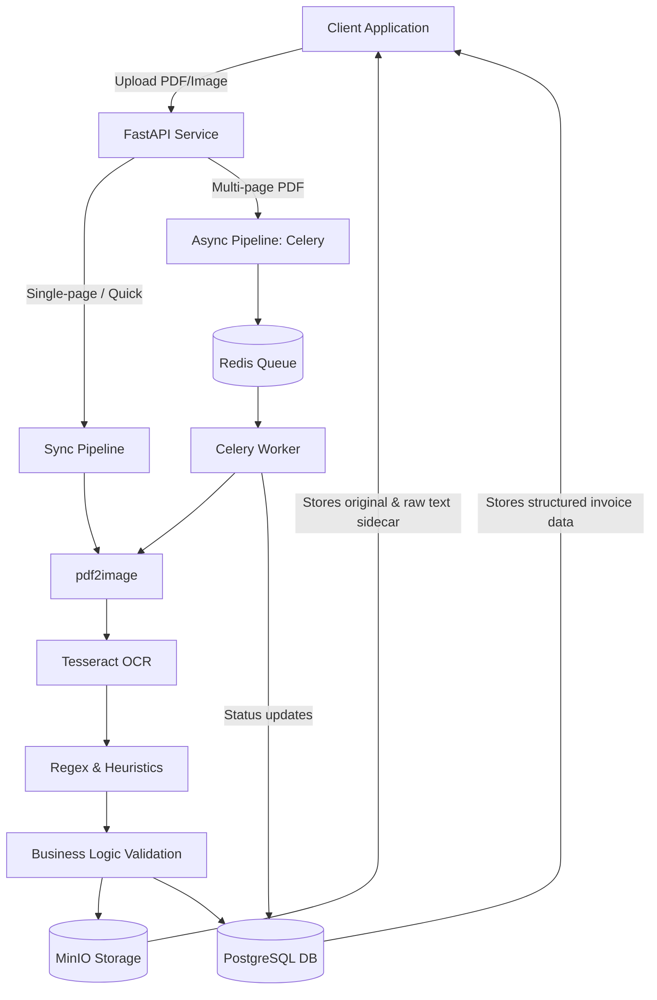

# Project: Invoice Processor & Validator

## 1. Problem Statement
Processing invoices manually is tedious, slow, and error-prone. Accounting and operations teams often spend hours copying data from PDFs into systems of record. This microservice automates invoice processing by receiving invoices (PDF or images), extracting structured data via OCR (Optical Character Recognition) and heuristics, validating fiscal rules (like tax calculations and VAT formatting), and exporting the clean data to JSON/CSV or pushing it directly to Google Sheets.

## 2. Architecture
The architecture is designed to handle both synchronous (single page, fast) and asynchronous (multi-page, heavy OCR) workloads.



1. **Ingestion**: API receives PDF or Image payload.
2. **Preprocessing**: Converts PDFs to images via `pdf2image` (requires `poppler-utils`).
3. **OCR Engine**: Tesseract extracts raw text from the images.
4. **Extraction**: Regex and heuristics parse specific fields (Issuer, VAT, Dates, Totals, Line Items).
5. **Validation**: Business logic validates tax amounts, mathematical correctness, and required fields.
6. **Storage**: Extracted structured data goes to PostgreSQL, original files and raw text sidecars to MinIO.

## 3. Tech Stack
- **Framework**: FastAPI
- **OCR Engine**: Tesseract OCR, pytesseract
- **Image Processing**: pdf2image, Pillow, poppler-utils
- **Queue/Worker**: Celery + Redis (for async multi-page processing)
- **Database**: PostgreSQL
- **Storage**: MinIO

## 4. Environment Variables
Ensure the following variables are configured in `.env`:

```ini
# Database
DATABASE_URL=postgresql://user:password@db:5432/invoices

# Redis / Celery
REDIS_URL=redis://redis:6379/0

# MinIO
MINIO_ENDPOINT=minio:9000
MINIO_ACCESS_KEY=minioadmin
MINIO_SECRET_KEY=minioadmin
MINIO_BUCKET=invoices-bucket

# Application Configuration
TESSERACT_CMD=/usr/bin/tesseract
MAX_SYNC_PAGES=3

# Integrations (Optional)
GOOGLE_SHEETS_CREDENTIALS=path/to/service-account.json
```

## 5. Database Schema
```sql
CREATE EXTENSION IF NOT EXISTS "uuid-ossp";

CREATE TABLE invoices (
    invoice_id UUID PRIMARY KEY DEFAULT uuid_generate_v4(),
    original_filename VARCHAR(255) NOT NULL,
    minio_key VARCHAR(500) NOT NULL,
    issuer_name VARCHAR(255),
    issuer_vat VARCHAR(50),
    recipient_name VARCHAR(255),
    recipient_vat VARCHAR(50),
    invoice_number VARCHAR(100),
    invoice_date DATE,
    due_date DATE,
    subtotal DECIMAL(12, 2),
    tax_rate DECIMAL(5, 2),
    tax_amount DECIMAL(12, 2),
    total DECIMAL(12, 2),
    currency VARCHAR(10),
    is_valid BOOLEAN DEFAULT FALSE,
    validation_errors JSONB,
    status VARCHAR(50) DEFAULT 'COMPLETED', -- PENDING, PROCESSING, COMPLETED, FAILED
    created_at TIMESTAMP DEFAULT NOW()
);

CREATE TABLE line_items (
    item_id UUID PRIMARY KEY DEFAULT uuid_generate_v4(),
    invoice_id UUID REFERENCES invoices(invoice_id) ON DELETE CASCADE,
    description TEXT,
    quantity DECIMAL(10, 2),
    unit_price DECIMAL(12, 2),
    line_total DECIMAL(12, 2)
);

-- Indexes for fast retrieval
CREATE INDEX idx_invoices_status ON invoices(status);
CREATE INDEX idx_invoices_created_at ON invoices(created_at);
```

## 6. API Endpoints

### 6.1 POST /api/v1/invoices/process (Synchronous)
Processes a single-page invoice immediately.
```bash
curl -X POST "http://localhost:8000/api/v1/invoices/process" \
  -F "file=@invoice_single.pdf"
```
**Response:**
```json
{
  "invoice_id": "abc12345-6789-def0-1234-56789abcdef0",
  "issuer_name": "Tech Corp",
  "total": 1500.00,
  "is_valid": true,
  "validation_errors": [],
  "line_items": [
    {"description": "Consulting Services", "quantity": 10, "unit_price": 150.0, "line_total": 1500.00}
  ]
}
```

### 6.2 POST /api/v1/invoices/upload (Asynchronous)
Uploads a large/multi-page invoice for background OCR processing.
```bash
curl -X POST "http://localhost:8000/api/v1/invoices/upload" \
  -F "file=@massive_invoice_100_pages.pdf"
```
**Response:**
```json
{
  "job_id": "job-9876-5432-10",
  "status": "PENDING",
  "message": "Invoice queued for asynchronous processing."
}
```

### 6.3 GET /api/v1/invoices/jobs/{job_id}
Poll status of an async OCR job.
```bash
curl -X GET "http://localhost:8000/api/v1/invoices/jobs/job-9876-5432-10"
```
**Response:**
```json
{
  "job_id": "job-9876-5432-10",
  "status": "PROCESSING",
  "progress": "50%",
  "message": "Extracting text from page 50 of 100"
}
```

### 6.4 GET /api/v1/invoices
List all processed invoices with pagination.
```bash
curl -X GET "http://localhost:8000/api/v1/invoices?page=1&limit=10"
```
**Response:**
```json
{
  "data": [
    {
      "invoice_id": "abc12345-...",
      "issuer_name": "Tech Corp",
      "total": 1500.00,
      "is_valid": true,
      "created_at": "2026-09-21T11:00:00Z"
    }
  ],
  "total_records": 150,
  "page": 1,
  "limit": 10
}
```

### 6.5 GET /api/v1/invoices/{id}
Retrieve full details of a specific invoice.
```bash
curl -X GET "http://localhost:8000/api/v1/invoices/abc12345-6789-def0-1234-56789abcdef0"
```
**Response:**
```json
{
  "invoice_id": "abc12345-6789-def0-1234-56789abcdef0",
  "original_filename": "invoice_single.pdf",
  "minio_key": "invoices/2026/09/invoice_single.pdf",
  "issuer_name": "Tech Corp",
  "issuer_vat": "US123456789",
  "recipient_name": "Acme Inc",
  "invoice_date": "2026-09-15",
  "subtotal": 1250.00,
  "tax_rate": 20.0,
  "tax_amount": 250.00,
  "total": 1500.00,
  "is_valid": true,
  "validation_errors": [],
  "line_items": [
    {
      "description": "Consulting Services",
      "quantity": 10,
      "unit_price": 125.00,
      "line_total": 1250.00
    }
  ]
}
```

### 6.6 POST /api/v1/invoices/export
Export data to CSV or Google Sheets.
```bash
curl -X POST "http://localhost:8000/api/v1/invoices/export" \
  -H "Content-Type: application/json" \
  -d '{"format": "google_sheets", "sheet_id": "1BxiMVs0XRYFgCE...", "start_date": "2026-09-01", "end_date": "2026-09-30"}'
```
**Response:**
```json
{
  "status": "SUCCESS",
  "exported_records": 42,
  "destination": "https://docs.google.com/spreadsheets/d/1BxiMVs0XRYFgCE..."
}
```

## 7. Validation Rules
- **Tax Verification**: `subtotal * tax_rate == tax_amount` (with minor rounding tolerance)
- **Total Verification**: `subtotal + tax_amount == total`
- **VAT Format**: Regex validation for country-specific VAT numbers (e.g., EU VAT patterns).
- **Required Fields**: Issuer, Total, Date must exist for the invoice to be flagged `is_valid=true`.

## 8. Docker Services & Setup
CRITICAL: The Dockerfile must install `tesseract-ocr` and `poppler-utils`.

```dockerfile
# Snippet for Dockerfile
FROM python:3.11-slim
RUN apt-get update && apt-get install -y tesseract-ocr poppler-utils && rm -rf /var/lib/apt/lists/*
# ... rest of Dockerfile
```

```yaml
version: '3.8'
services:
  api:
    build: .
    ports: ["8000:8000"]
    depends_on: [db, minio, redis]
    environment:
      - DATABASE_URL=postgresql://user:password@db:5432/invoices
      - MINIO_ENDPOINT=minio:9000
      - REDIS_URL=redis://redis:6379/0
      - PYTHONPATH=/app
  worker:
    build: .
    command: celery -A app.core.celery_app worker --loglevel=info
    depends_on: [db, minio, redis]
    environment:
      - DATABASE_URL=postgresql://user:password@db:5432/invoices
      - MINIO_ENDPOINT=minio:9000
      - REDIS_URL=redis://redis:6379/0
      - PYTHONPATH=/app
  db:
    image: postgres:15
    environment:
      - POSTGRES_USER=user
      - POSTGRES_PASSWORD=password
      - POSTGRES_DB=invoices
  redis:
    image: redis:7-alpine
  minio:
    image: minio/minio
    command: server /data --console-address ":9001"
```

## 9. File Structure
```
05-invoice-processor/
├── app/
│   ├── api/
│   │   ├── routes.py
│   │   └── dependencies.py
│   ├── core/
│   │   ├── celery_app.py
│   │   ├── ocr_engine.py
│   │   └── config.py
│   ├── services/
│   │   ├── extractor.py
│   │   ├── validator.py
│   │   └── exporter.py
│   ├── models/
│   │   └── database.py
│   └── main.py
├── tests/
│   ├── fixtures/
│   │   ├── raw_text_1.txt
│   │   └── invoice_sample.pdf
│   ├── test_ocr_engine.py
│   ├── test_extractor.py
│   └── test_api.py
├── Dockerfile
├── docker-compose.yml
└── requirements.txt
```

## 10. Implementation Steps
1. **Repo skeleton + infra** — Create the tree from section 9; `docker-compose.yml` with all services. Ensure Dockerfile includes `tesseract-ocr` and `poppler-utils`. *Verify:* `docker compose up -d` → healthy; `tesseract --version` runs inside container.
2. **Schema** — Apply `invoices`/`line_items` tables via SQL init file.
3. **OCR pipeline (Standalone)** — Build `core/ocr_engine.py`: `pdf2image` → `pytesseract` → raw text. Write `tests/test_ocr_engine.py`. E.g., ensure it properly handles multi-page PDFs by joining text.
4. **Regex extraction (Unit-tested)** — Implement `services/extractor.py` operating purely on plain strings. Tests should use raw text fixtures, avoiding OCR overhead during testing.
5. **Validation rules** — Implement `services/validator.py` enforcing rules (math checks, VAT regex).
6. **Storage wiring** — Save original PDF and raw `.txt` sidecar to MinIO. Store DB records.
7. **Async Celery setup** — Wire `app/core/celery_app.py`. Implement background task for files > `MAX_SYNC_PAGES` limit.
8. **Endpoint wiring** — Implement all endpoints documented in section 6.
9. **Full stack smoke test** — End-to-end processing of a sample PDF through the API, verifying DB record and MinIO artifacts.

## 11. Testing Strategy
1. **Sample Invoices:** Store 5-10 PDFs in `tests/fixtures/`, covering clean, noisy, and mathematically incorrect cases.
2. **Unit Tests (Fast):** Test regex extractors against pre-extracted `raw_text_X.txt` fixtures. Test business rules with mocked Python dicts.
3. **Integration Tests (Slow):** E2E file upload, verifying Celery queueing (or sync processing), OCR execution, and DB persistence.

