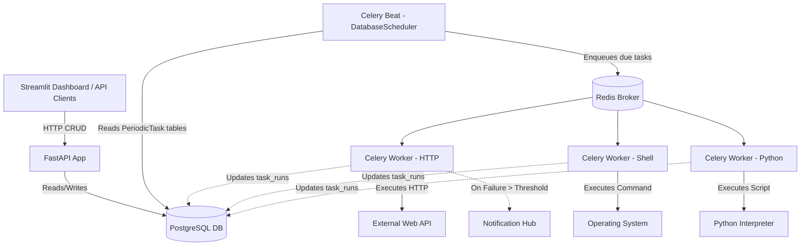

# Project: Task Scheduler Engine

## 1. Problem Statement
Managing background jobs via standard `cron` is fragile: it lacks visibility, doesn't support complex retries natively, provides poor alerting on failures, and offers no out-of-the-box way to chain tasks together (e.g., Run Task B only if Task A succeeds). 

This Task Scheduler Engine provides a modern, visual alternative to manage, execute, monitor, and retry background jobs. It orchestrates HTTP requests, shell commands, and Python scripts with robust dependency management, database-backed state, and dynamic scheduling.

## 2. Architecture
Celery Beat runs with a PostgreSQL-backed scheduler from the maintained `sqlalchemy-celery-beat` package, so schedules can be added, changed or paused at runtime without restarting Beat. The API owns the `tasks` table and keeps one `PeriodicTask` row (the library's own table) in sync with each task.



## 3. Features
- **Dynamic Scheduling**: Add, modify, or delete tasks on the fly without restarting the scheduler. Beat's `DatabaseScheduler` picks up changes to the `PeriodicTask` tables automatically.
- **Execution Types**: 
  - *HTTP Requests* (webhooks, API polling)
  - *Shell Commands* (db backups, file manipulation)
  - *Python Scripts* (custom logic)
- **Retry Mechanism**: Configurable exponential backoff leveraging Celery's native retry features.
- **History & Logs**: Retain stdout, stderr, run durations, and completion states in PostgreSQL.
- **Dependencies**: Execute Task B only if Task A's last run was successful.
- **Alerting**: Integration with a central Notification Hub upon exceeding consecutive failure thresholds.

## 4. Tech Stack
- **API**: FastAPI
- **Engine**: Celery Beat + Redis, with `sqlalchemy-celery-beat` (`DatabaseScheduler`) storing schedules in PostgreSQL
- **Database**: PostgreSQL (via SQLAlchemy/asyncpg)
- **UI Dashboard**: Streamlit
- **Deployment**: Docker Compose

## 5. Environment Variables
Configure these in your `.env`:

```ini
# Database
DATABASE_URL=postgresql://user:password@db:5432/scheduler

# Redis / Celery
REDIS_URL=redis://redis:6379/0

# Alerting
NOTIFICATION_HUB_URL=http://notifier:8000/api/v1/notify

# Engine configuration
MAX_RETRIES=3
BASE_BACKOFF_SECONDS=60
BEAT_POLL_INTERVAL=60
```

## 6. Database Schema
```sql
CREATE EXTENSION IF NOT EXISTS "uuid-ossp";

CREATE TABLE tasks (
    task_id UUID PRIMARY KEY DEFAULT uuid_generate_v4(),
    name VARCHAR(255) NOT NULL,
    task_type VARCHAR(50) NOT NULL, -- HTTP, SHELL, PYTHON
    payload JSONB NOT NULL,
    schedule VARCHAR(100), -- Cron expression
    max_retries INT DEFAULT 3,
    retry_backoff INT DEFAULT 60,
    is_active BOOLEAN DEFAULT TRUE,
    last_run_at TIMESTAMP,
    consecutive_failures INT DEFAULT 0,
    created_at TIMESTAMP DEFAULT NOW()
);

CREATE TABLE task_runs (
    run_id UUID PRIMARY KEY DEFAULT uuid_generate_v4(),
    task_id UUID REFERENCES tasks(task_id) ON DELETE CASCADE,
    status VARCHAR(50) NOT NULL, -- SUCCESS, FAILED, RUNNING
    stdout TEXT,
    stderr TEXT,
    started_at TIMESTAMP DEFAULT NOW(),
    finished_at TIMESTAMP,
    duration_ms INT
);

CREATE TABLE task_dependencies (
    task_id UUID REFERENCES tasks(task_id) ON DELETE CASCADE,
    depends_on_task_id UUID REFERENCES tasks(task_id) ON DELETE CASCADE,
    PRIMARY KEY (task_id, depends_on_task_id)
);

CREATE INDEX idx_tasks_active ON tasks(is_active);
CREATE INDEX idx_tasks_polling ON tasks(is_active, last_run_at);
CREATE INDEX idx_task_runs_task_id ON task_runs(task_id);
```

## 7. API Endpoints

### 7.1 POST /api/v1/tasks
Create a new task.
```bash
curl -X POST "http://localhost:8000/api/v1/tasks" \
  -H "Content-Type: application/json" \
  -d '{
    "name": "Nightly Database Backup",
    "task_type": "SHELL",
    "payload": {"command": "pg_dump -U user db > /backups/db.sql"},
    "schedule": "0 2 * * *",
    "max_retries": 3,
    "retry_backoff": 60
  }'
```
**Response:**
```json
{
  "task_id": "e4b3c2a1...",
  "name": "Nightly Database Backup",
  "status": "CREATED"
}
```

### 7.2 GET /api/v1/tasks
List all tasks.
```bash
curl -X GET "http://localhost:8000/api/v1/tasks"
```
**Response:**
```json
[
  {
    "task_id": "e4b3c2a1...",
    "name": "Nightly Database Backup",
    "task_type": "SHELL",
    "schedule": "0 2 * * *",
    "is_active": true
  }
]
```

### 7.3 GET /api/v1/tasks/{id}
Get a single task by ID.
```bash
curl -X GET "http://localhost:8000/api/v1/tasks/e4b3c2a1-..."
```
**Response:**
```json
{
  "task_id": "e4b3c2a1...",
  "name": "Nightly Database Backup",
  "task_type": "SHELL",
  "payload": {"command": "pg_dump -U user db > /backups/db.sql"},
  "schedule": "0 2 * * *",
  "is_active": true,
  "last_run_at": "2026-09-20T02:00:00Z"
}
```

### 7.4 PUT /api/v1/tasks/{id}
Update a task (e.g., change cron, edit command, toggle pause).
```bash
curl -X PUT "http://localhost:8000/api/v1/tasks/e4b3c2a1-..." \
  -H "Content-Type: application/json" \
  -d '{
    "is_active": false,
    "schedule": "30 2 * * *"
  }'
```
**Response:**
```json
{
  "task_id": "e4b3c2a1...",
  "status": "UPDATED"
}
```

### 7.5 DELETE /api/v1/tasks/{id}
Delete a task.
```bash
curl -X DELETE "http://localhost:8000/api/v1/tasks/e4b3c2a1-..."
```
**Response:**
```json
{
  "task_id": "e4b3c2a1...",
  "status": "DELETED"
}
```

### 7.6 POST /api/v1/tasks/{id}/trigger
Manually trigger a task immediately, ignoring schedule.
```bash
curl -X POST "http://localhost:8000/api/v1/tasks/e4b3c2a1-.../trigger"
```
**Response:**
```json
{
  "task_id": "e4b3c2a1...",
  "run_id": "r1a2b3c4...",
  "message": "Task manually enqueued."
}
```

### 7.7 GET /api/v1/tasks/{id}/runs
Get execution history with logs.
```bash
curl -X GET "http://localhost:8000/api/v1/tasks/e4b3c2a1-.../runs?limit=5"
```
**Response:**
```json
[
  {
    "run_id": "r1a2b3c4...",
    "status": "SUCCESS",
    "stdout": "Backup completed in 15s.",
    "stderr": "",
    "started_at": "2026-09-20T02:00:00Z",
    "duration_ms": 15000
  }
]
```

## 8. Docker Services

> **Note:** The `NOTIFICATION_HUB_URL` depends on `03-multi-channel-notifier`. This service must be running externally or on the same Docker network for alerts to work.

```yaml
version: '3.8'
services:
  api:
    build: .
    ports: ["8000:8000"]
    depends_on: [db, redis]
    environment:
      - DATABASE_URL=postgresql://user:password@db:5432/scheduler
      - REDIS_URL=redis://redis:6379/0
      - PYTHONPATH=/app
  scheduler:
    build: .
    command: celery -A app.core.celery_app beat -S sqlalchemy_celery_beat.schedulers:DatabaseScheduler --loglevel=info
    depends_on: [db, redis]
    environment:
      - DATABASE_URL=postgresql://user:password@db:5432/scheduler
      - REDIS_URL=redis://redis:6379/0
      - PYTHONPATH=/app
  worker:
    build: .
    command: celery -A app.core.celery_app worker --loglevel=info
    depends_on: [db, redis]
    environment:
      - DATABASE_URL=postgresql://user:password@db:5432/scheduler
      - REDIS_URL=redis://redis:6379/0
      - PYTHONPATH=/app
  dashboard:
    build: .
    command: streamlit run dashboard/app.py
    ports: ["8501:8501"]
    environment:
      - API_URL=http://api:8000
  db:
    image: postgres:15
    environment:
      - POSTGRES_USER=user
      - POSTGRES_PASSWORD=password
      - POSTGRES_DB=scheduler
  redis:
    image: redis:7-alpine
```

## 9. File Structure
```
06-scheduler-engine/
├── app/
│   ├── api/
│   │   ├── routes.py
│   │   └── schemas.py
│   ├── core/
│   │   ├── celery_app.py
│   │   └── config.py
│   ├── executors/
│   │   ├── http_executor.py
│   │   ├── shell_executor.py
│   │   └── python_executor.py
│   ├── models/
│   │   └── database.py
│   └── main.py
├── dashboard/
│   └── app.py
├── tests/
│   ├── test_executors.py
│   └── test_api.py
├── Dockerfile
├── docker-compose.yml
└── requirements.txt
```

## 10. Implementation Steps
1. **Repo skeleton + infra** — create the tree from section 9; `docker-compose.yml` with all services. *Verify:* `docker compose up -d` → healthy.
2. **Schema & Models** — Apply `tasks`, `task_runs`, `task_dependencies` via an init SQL file. Map SQLAlchemy models.
3. **Executors (Standalone Tests)** — Implement `executors/http_executor.py`, `shell_executor.py` (subprocess with timeout), and `python_executor.py` (exec with isolated locals). Test without DB/Celery dependencies.
4. **Celery Beat Database Scheduler** — Use `sqlalchemy-celery-beat` (not the abandoned `celery-sqlalchemy-scheduler`, last released 2021). In `app/core/celery_app.py` set `beat_dburi` to the same PostgreSQL URL (sync driver, e.g. `postgresql+psycopg2://...`) and start Beat with `-S sqlalchemy_celery_beat.schedulers:DatabaseScheduler`. The library creates its own tables (`PeriodicTask`, `CrontabSchedule`, ...). The API remains the owner of `tasks`: creating, editing, pausing or deleting a task creates/updates/disables/deletes exactly one `PeriodicTask` (named `task-<task_id>`, pointing to the worker task with the task id as argument) in the **same transaction**. Change `PeriodicTask` rows through ORM objects; a bulk `UPDATE` statement is not detected by Beat unless `PeriodicTaskChanged` is also updated (see the library README).
5. **Worker Execution Logic** — The Celery worker processes the enqueued job: updates `task_runs` to RUNNING, checks `task_dependencies`, executes via the appropriate Executor, and updates `task_runs` to SUCCESS/FAILED.
6. **Retry & Alerting** — On failure, if `run_count < max_retries`, raise `self.retry(countdown=backoff)`. If final failure, increment `consecutive_failures`. If threshold exceeded, POST to `NOTIFICATION_HUB_URL`.
7. **API Endpoints** — Wire all FastAPI CRUD routes per section 7.
8. **Streamlit Dashboard** — Build a simple React-like UI in Streamlit to fetch `/api/v1/tasks` and display them in a table, with buttons to trigger/pause.
9. **Full Stack Smoke Test** — End to end test inserting a shell command schedule and watching logs populate.

## 11. Testing Strategy
1. **Unit tests (Executors):** Mock HTTP calls, test subprocess timeouts, validate python eval safety mechanisms.
2. **Schedule sync test:** creating/pausing/deleting a task via the API creates/disables/removes exactly one matching `PeriodicTask`; a due task produces a `task_runs` row.
3. **Integration tests:** Check dependency-skip logic, retry backoff calculation, and API CRUD correctness.
