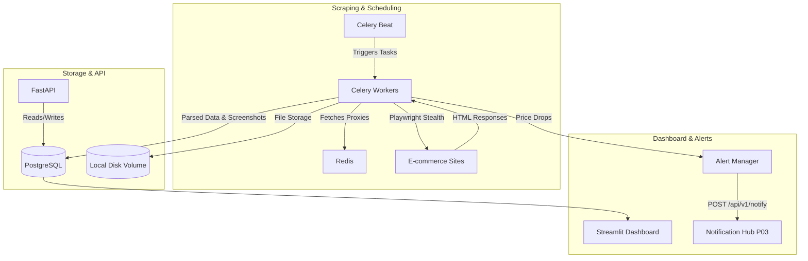

# Project: E-Commerce Price Monitor

## 1. Problem Statement
Monitoring product prices across different e-commerce platforms is a tedious and manual process. Consumers and businesses lose money by missing out on temporary price drops and flash sales. Existing solutions are often limited to a single platform, lack historical data visualization, or are easily blocked by anti-bot measures. 

This project aims to build a robust, stealthy, and scalable E-Commerce Price Monitor that tracks prices across Amazon, MercadoLibre, and custom sites. It will detect price changes, store historical data, capture visual proof (screenshots) upon changes, alert users via a centralized Notification Hub, and provide a comprehensive dashboard for historical trend analysis.

## 2. Architecture & Tech Stack

### 2.1 Architecture Diagram



### 2.2 Tech Stack
*   **Web Scraping:** Playwright (Headless Chrome), `playwright-stealth` (Anti-detection), BeautifulSoup4, `selectolax`
*   **Scheduling & Background Jobs:** Celery Beat, Celery Workers, Redis (Broker & Proxy Cache)
*   **Database:** PostgreSQL (Products, Price History, Alerts, Logs)
*   **Backend API:** FastAPI (RESTful endpoints for CRUD and settings)
*   **Frontend Dashboard:** Streamlit (UI), Plotly (Price trend charts)
*   **Infrastructure:** Docker, Docker Compose

## 3. Anti-Detection Strategy

To reliably scrape data without getting blocked, the following strategies are implemented:
1.  **Playwright Stealth:** Overrides common headless browser signatures (e.g., `navigator.webdriver`).
2.  **User-Agent Rotation:** Randomized User-Agents using a curated list of modern desktop and mobile browsers.
3.  **Proxy Rotation:** Requests are routed through a pool of residential/datacenter proxies.
4.  **Random Delays:** Adds realistic human-like delays (2-7 seconds) between page interactions and scrolling.
5.  **Viewport Randomization:** Randomizes window sizes to emulate different device resolutions.

## 4. Database Schema

```sql
CREATE TABLE products (
    id UUID PRIMARY KEY DEFAULT gen_random_uuid(),
    name VARCHAR(255) NOT NULL,
    url TEXT UNIQUE NOT NULL,
    site_domain VARCHAR(100) NOT NULL, -- e.g., 'amazon.com', 'mercadolibre.com'
    css_selectors JSONB, -- Custom selectors if site is custom
    target_price DECIMAL(10, 2),
    alert_threshold_pct DECIMAL(5, 2) DEFAULT 0, -- e.g., 5 for 5% drop
    alert_threshold_abs DECIMAL(10, 2) DEFAULT 0, -- e.g., 10 for $10 drop
    currency VARCHAR(10) DEFAULT 'USD',
    check_interval_hours INTEGER DEFAULT 6,
    is_active BOOLEAN DEFAULT TRUE,
    last_scraped_at TIMESTAMP WITH TIME ZONE,
    created_at TIMESTAMP WITH TIME ZONE DEFAULT CURRENT_TIMESTAMP,
    updated_at TIMESTAMP WITH TIME ZONE DEFAULT CURRENT_TIMESTAMP
);

CREATE TABLE price_history (
    id UUID PRIMARY KEY DEFAULT gen_random_uuid(),
    product_id UUID REFERENCES products(id) ON DELETE CASCADE,
    price DECIMAL(10, 2) NOT NULL,
    currency VARCHAR(10) DEFAULT 'USD',
    availability BOOLEAN DEFAULT TRUE,
    rating DECIMAL(3, 2),
    reviews_count INTEGER,
    seller_reputation VARCHAR(100), -- specific to ML
    shipping_info TEXT,
    screenshot_path TEXT, -- Null unless price changed
    scraped_at TIMESTAMP WITH TIME ZONE DEFAULT CURRENT_TIMESTAMP
);

CREATE TABLE alerts (
    id UUID PRIMARY KEY DEFAULT gen_random_uuid(),
    product_id UUID REFERENCES products(id) ON DELETE CASCADE,
    old_price DECIMAL(10, 2),
    new_price DECIMAL(10, 2),
    alert_type VARCHAR(50), -- 'HUB_NOTIFICATION'
    status VARCHAR(50), -- 'SENT', 'FAILED'
    sent_at TIMESTAMP WITH TIME ZONE DEFAULT CURRENT_TIMESTAMP
);

CREATE TABLE scraping_logs (
    id UUID PRIMARY KEY DEFAULT gen_random_uuid(),
    product_id UUID REFERENCES products(id) ON DELETE CASCADE,
    status VARCHAR(50), -- 'SUCCESS', 'BLOCKED', 'TIMEOUT'
    error_message TEXT,
    proxy_used VARCHAR(255),
    executed_at TIMESTAMP WITH TIME ZONE DEFAULT CURRENT_TIMESTAMP
);

-- Indexes for performance
CREATE INDEX idx_price_history_product_time ON price_history(product_id, scraped_at);
CREATE INDEX idx_alerts_product ON alerts(product_id);
CREATE INDEX idx_scraping_logs_product ON scraping_logs(product_id, executed_at);
```

## 5. API Endpoints

| Method | Endpoint | Description |
| :--- | :--- | :--- |
| `POST` | `/api/v1/products/` | Add a new product to monitor |
| `GET` | `/api/v1/products/` | List all monitored products |
| `GET` | `/api/v1/products/{id}` | Get single product details |
| `DELETE`| `/api/v1/products/{id}` | Remove a product |
| `PATCH` | `/api/v1/products/{id}` | Update product (toggle is_active, update thresholds) |
| `GET` | `/api/v1/products/{id}/history` | Get time-series price history |
| `GET` | `/api/v1/export/csv` | Export price history as CSV |

### Example 1: Add Product (POST `/api/v1/products/`)
**Request:**
```bash
curl -X POST "http://localhost:8000/api/v1/products/" \
     -H "Content-Type: application/json" \
     -d '{
           "name": "Sony WH-1000XM5",
           "url": "https://www.amazon.com/dp/B09XS7JWHH",
           "site_domain": "amazon",
           "target_price": 299.99,
           "alert_threshold_pct": 5.0,
           "currency": "USD",
           "check_interval_hours": 12
         }'
```
**Response:**
```json
{
  "id": "e987f6c3-1234-5678-abcd-123456789abc",
  "message": "Product added successfully."
}
```

### Example 2: List Products (GET `/api/v1/products/`)
**Request:**
```bash
curl -X GET "http://localhost:8000/api/v1/products/"
```
**Response:**
```json
[
  {
    "id": "e987f6c3-1234-5678-abcd-123456789abc",
    "name": "Sony WH-1000XM5",
    "site_domain": "amazon",
    "target_price": 299.99,
    "last_scraped_at": "2024-03-01T12:00:00Z",
    "is_active": true
  }
]
```

### Example 3: Get Product (GET `/api/v1/products/{id}`)
**Request:**
```bash
curl -X GET "http://localhost:8000/api/v1/products/e987f6c3-1234-5678-abcd-123456789abc"
```
**Response:**
```json
{
  "id": "e987f6c3-1234-5678-abcd-123456789abc",
  "name": "Sony WH-1000XM5",
  "url": "https://www.amazon.com/dp/B09XS7JWHH",
  "target_price": 299.99,
  "alert_threshold_pct": 5.0,
  "currency": "USD",
  "check_interval_hours": 12,
  "is_active": true
}
```

### Example 4: Update Product (PATCH `/api/v1/products/{id}`)
**Request:**
```bash
curl -X PATCH "http://localhost:8000/api/v1/products/e987f6c3-1234-5678-abcd-123456789abc" \
     -H "Content-Type: application/json" \
     -d '{
           "is_active": false,
           "alert_threshold_pct": 10.0
         }'
```
**Response:**
```json
{
  "id": "e987f6c3-1234-5678-abcd-123456789abc",
  "message": "Product updated successfully."
}
```

### Example 5: Delete Product (DELETE `/api/v1/products/{id}`)
**Request:**
```bash
curl -X DELETE "http://localhost:8000/api/v1/products/e987f6c3-1234-5678-abcd-123456789abc"
```
**Response:**
```json
{
  "message": "Product deleted successfully."
}
```

### Example 6: Get Price History (GET `/api/v1/products/{id}/history`)
**Request:**
```bash
curl -X GET "http://localhost:8000/api/v1/products/e987f6c3-1234-5678-abcd-123456789abc/history?from=2024-01-01&to=2024-12-31&limit=100"
```
**Response:**
```json
[
  {
    "id": "a1b2c3d4-...",
    "price": 348.00,
    "scraped_at": "2024-02-28T10:00:00Z",
    "screenshot_path": null
  },
  {
    "id": "b2c3d4e5-...",
    "price": 298.00,
    "scraped_at": "2024-03-01T12:00:00Z",
    "screenshot_path": "/screenshots/20240301_sony_wh.png"
  }
]
```

### Example 7: Export Price History as CSV (GET `/api/v1/export/csv`)
**Request:**
```bash
curl -X GET "http://localhost:8000/api/v1/export/csv" -o prices.csv
```
**Response:**
(Returns a file download with `Content-Type: text/csv`)

## 6. Implementation Code Examples

### 6.1 Playwright Scraping Snippet

```python
import asyncio
from playwright.async_api import async_playwright
from playwright_stealth import stealth_async
import random

async def scrape_amazon_product(url: str, output_screenshot: str):
    async with async_playwright() as p:
        browser = await p.chromium.launch(headless=True)
        context = await browser.new_context(
            viewport={'width': random.randint(1280, 1920), 'height': random.randint(800, 1080)},
            user_agent='Mozilla/5.0 (Windows NT 10.0; Win64; x64) AppleWebKit/537.36 (KHTML, like Gecko) Chrome/120.0.0.0 Safari/537.36'
        )
        page = await context.new_page()
        await stealth_async(page)
        
        try:
            # Human-like delay before navigation
            await asyncio.sleep(random.uniform(2, 7))
            await page.goto(url, wait_until='domcontentloaded')
            
            # Scroll to simulate user behavior
            await page.evaluate("window.scrollTo(0, document.body.scrollHeight/2)")
            await asyncio.sleep(random.uniform(1, 3))
            
            # Extract Data
            price_element = await page.query_selector('.a-price .a-offscreen')
            title_element = await page.query_selector('#productTitle')
            
            price = await price_element.inner_text() if price_element else None
            title = await title_element.inner_text() if title_element else None
            
            # Capture screenshot
            await page.screenshot(path=output_screenshot, full_page=False)
            
            return {"title": title.strip() if title else None, "price": price, "screenshot_path": output_screenshot}
            
        except Exception as e:
            print(f"Scraping failed: {e}")
            return None
        finally:
            await browser.close()

# Note: Celery tasks are synchronous by default. To call the async Playwright function:
# def celery_scrape_task(url, screenshot_path):
#     return asyncio.run(scrape_amazon_product(url, screenshot_path))
```

## 7. Docker Services & File Structure

### 7.1 `docker-compose.yml` Services
```yaml
version: '3.8'
services:
  postgres:
    image: postgres:15
    environment:
      POSTGRES_USER: user
      POSTGRES_PASSWORD: pass
      POSTGRES_DB: pricemonitor
    ports: ["5432:5432"]
  redis:
    image: redis:7-alpine
    ports: ["6379:6379"]
  api:
    build: .
    command: uvicorn api.main:app --host 0.0.0.0
    ports: ["8000:8000"]
    depends_on: [postgres, redis]
  celery_worker:
    build: .
    command: celery -A scraper.tasks worker -l info
    depends_on: [postgres, redis]
  celery_beat:
    build: .
    command: celery -A scraper.tasks beat -l info
    depends_on: [postgres, redis]
  dashboard:
    build: .
    command: streamlit run dashboard/app.py
    ports: ["8501:8501"]
    depends_on: [api]
```

### 7.2 File Structure
```text
07-price-monitor/
├── api/
│   ├── main.py
│   ├── routes.py
│   └── schemas.py
├── scraper/
│   ├── tasks.py
│   ├── parsers/
│   │   ├── amazon.py
│   │   ├── mercadolibre.py
│   │   └── custom.py
│   └── stealth_config.py
├── dashboard/
│   └── app.py
├── db/
│   ├── models.py
│   └── schema.sql
├── docker-compose.yml
├── requirements.txt
└── README.md
```

## 8. Implementation Steps & Testing Strategy

### Implementation Steps:
1.  **Repo skeleton + minimal infra:** create the tree from section 7.2; `docker-compose.yml` with `postgres` and `redis` only. *Verify:* `docker compose up -d postgres redis` → healthy.
2.  **Schema via plain SQL:** apply `products`, `price_history`, `alerts`, `scraping_logs` from section 4 via a plain init SQL file. *Verify:* `\dt` lists all 4 tables, verify new columns and indexes.
3.  **Local screenshot storage:** create a `./screenshots/` volume mounted into the `celery_worker` container. Update scraper to save screenshots using `page.screenshot()`. *Verify:* screenshots are stored correctly on disk.
4.  **Parser logic, unit-tested standalone:** implement `scraper/parsers/amazon.py` and `mercadolibre.py` returning data from a saved HTML fixture. *Verify:* `pytest tests/test_parsers.py -v` passes.
5.  **Playwright scraping + stealth:** wire snippet from section 6.1 into `scraper/tasks.py`. Ensure delays are `random.uniform(2, 7)`.
6.  **Celery Beat scheduling:** configure Celery Beat to respect `check_interval_hours`. *Verify:* jobs execute at the expected time.
7.  **Alerting module (Notification Hub P03):** on a price change crossing `alert_threshold_pct`/`alert_threshold_abs`, trigger a POST to `NOTIFICATION_HUB_URL/api/v1/notify` instead of raw SMTP/Telegram. *Verify:* mocked call goes to the hub successfully.
8.  **API endpoints:** implement all endpoints (GET, POST, PATCH, DELETE) from section 5. *Verify:* curl requests succeed and match response schemas.
9.  **Dashboard:** build the Streamlit UI with Plotly line charts.
10. **Full stack + smoke test:** `docker compose up -d`, add a product, force scrape cycle, test screenshot generation and alert triggering.

### Testing Strategy:
*   **Unit Tests:** parser logic against saved HTML fixtures.
*   **Integration Tests:** API endpoints and DB insertions.
*   **Anti-Bot Testing:** run headless scraping against bot-check sites.
*   **Alert Testing:** mock Notification Hub responses to verify alerting flow.

### Environment Variables (.env)
```env
DATABASE_URL=postgresql://user:pass@db:5432/pricemonitor
REDIS_URL=redis://redis:6379/0
NOTIFICATION_HUB_URL=http://notification-hub:8000
PROXY_LIST_URL=optional_proxy_pool_url
# Fallbacks
TELEGRAM_BOT_TOKEN=your_bot_token
TELEGRAM_CHAT_ID=your_chat_id
SMTP_HOST=smtp.gmail.com
SMTP_USER=your_email@gmail.com
SMTP_PASS=app_specific_password
```
