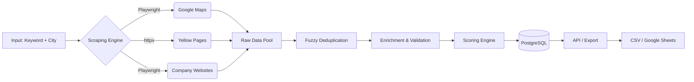

# Project: B2B Lead Generator

## 1. Problem Statement
Sales and marketing teams spend countless hours manually searching Google Maps, business directories, and company websites to find prospective B2B clients. Data is often duplicated, unstructured, or missing critical contact information. 

This project aims to automate the generation of high-quality B2B leads by scraping multiple public sources concurrently, deduplicating records using fuzzy matching, enriching the data (email validation, phone normalization, geocoding), and scoring leads based on completeness. The final structured data is highly actionable for outbound sales campaigns.

## 2. Architecture & Pipeline

### 2.1 Pipeline Diagram



### 2.2 Tech Stack
*   **Scraping:** Playwright (for dynamic SPAs like Maps), `httpx` (for static directories), BeautifulSoup4
*   **Data Processing:** Pandas, `rapidfuzz` (Deduplication — faster, actively maintained alternative)
*   **Enrichment:** `phonenumbers` (E.164 normalization), DNS resolver (MX checks)
*   **Export:** `google-auth`, `gspread` (Google Sheets integration)
*   **Database:** PostgreSQL with Full-Text Search
*   **API:** FastAPI
*   **Infrastructure:** Docker, Docker Compose

## 3. Core Processing Modules

### 3.1 Deduplication Strategy
Leads aggregated from multiple sources (e.g., a restaurant found on Google Maps and Yelp) often have slight name variations. 
We use `rapidfuzz` to match strings efficiently.
*   **Threshold:** >85% match on Name AND identical/fuzzy match on normalized Phone/Address.
*   **Action:** Merge records, preferring data from the source with higher domain authority.

### 3.2 Lead Scoring
Leads are scored from 0-100 based on the presence and validity of data:
*   Email present & validated (+30)
*   Phone present & normalized (+20)
*   Website present (+20)
*   Address & Geolocation present (+15)
*   Category & Rating present (+15)

### 3.3 Anti-Detection Strategy for Google Maps
To reliably scrape Google Maps and similar services without blocks:
1.  **Proxy Rotation:** Requests route through randomized proxies.
2.  **Random Delays:** Adds realistic human-like scroll and click delays (2-7 seconds).
3.  **Headless Detection Avoidance:** Uses Playwright stealth tactics to mask browser signatures (`navigator.webdriver`).

## 4. Database Schema

```sql
CREATE TABLE scraping_sessions (
    id UUID PRIMARY KEY DEFAULT gen_random_uuid(),
    keyword VARCHAR(100) NOT NULL,
    location VARCHAR(100) NOT NULL,
    status VARCHAR(50) DEFAULT 'RUNNING',
    total_found INTEGER DEFAULT 0,
    started_at TIMESTAMP WITH TIME ZONE DEFAULT CURRENT_TIMESTAMP,
    completed_at TIMESTAMP WITH TIME ZONE
);

CREATE TABLE leads (
    id UUID PRIMARY KEY DEFAULT gen_random_uuid(),
    -- SET NULL: leads are the product; deleting a session's record must not delete its leads.
    session_id UUID REFERENCES scraping_sessions(id) ON DELETE SET NULL,
    company_name VARCHAR(255) NOT NULL,
    normalized_name VARCHAR(255),
    category VARCHAR(100),
    website TEXT,
    email VARCHAR(255),
    is_email_valid BOOLEAN,
    phone_raw VARCHAR(50),
    phone_e164 VARCHAR(20),
    address_raw TEXT,
    city VARCHAR(100),
    lat DECIMAL(10, 7),
    lng DECIMAL(10, 7),
    rating DECIMAL(2, 1),
    source_url TEXT,
    lead_score INTEGER DEFAULT 0,
    created_at TIMESTAMP WITH TIME ZONE DEFAULT CURRENT_TIMESTAMP,
    
    -- Null-safe unique constraint
    CONSTRAINT unique_website_phone UNIQUE NULLS NOT DISTINCT (website, phone_e164)
);

CREATE INDEX idx_leads_search ON leads USING GIN (to_tsvector('english', company_name || ' ' || category));

CREATE TABLE dedup_log (
    id UUID PRIMARY KEY DEFAULT gen_random_uuid(),
    session_id UUID REFERENCES scraping_sessions(id) ON DELETE CASCADE,
    surviving_lead_id UUID REFERENCES leads(id) ON DELETE SET NULL,
    merged_lead_id UUID, -- References the lead that was dropped/merged
    merged_lead_data JSONB,
    similarity_score DECIMAL(5,2),
    processed_at TIMESTAMP WITH TIME ZONE DEFAULT CURRENT_TIMESTAMP
);
```

## 5. API Endpoints

| Method | Endpoint | Description |
| :--- | :--- | :--- |
| `POST` | `/api/v1/jobs/` | Start a new lead generation job (async) |
| `GET` | `/api/v1/jobs/{id}` | Check status of a job |
| `GET` | `/api/v1/leads/` | Query leads |
| `PATCH` | `/api/v1/leads/{id}` | Update/Archive lead |
| `DELETE`| `/api/v1/leads/{id}` | Delete lead |
| `GET` | `/api/v1/leads/export` | Export leads to CSV or JSON |
| `POST` | `/api/v1/leads/export/sheets` | Export leads directly to Google Sheets |
| `POST` | `/api/v1/config/dedup` | Configure fuzzy match thresholds |

### Example 1: Trigger Job (POST `/api/v1/jobs/`)
**Request:**
```bash
curl -X POST "http://localhost:8000/api/v1/jobs/" \
     -H "Content-Type: application/json" \
     -d '{
           "keyword": "accounting firm",
           "location": "Austin, TX",
           "sources": ["google_maps", "yellow_pages"]
         }'
```
**Response:**
```json
{
  "job_id": "1a2b3c4d-...",
  "status": "RUNNING",
  "message": "Job enqueued successfully."
}
```

### Example 2: Update Lead (PATCH `/api/v1/leads/{id}`)
**Request:**
```bash
curl -X PATCH "http://localhost:8000/api/v1/leads/1a2b3c4d-..." \
     -H "Content-Type: application/json" \
     -d '{ "lead_score": 90 }'
```
**Response:**
```json
{
  "id": "1a2b3c4d-...",
  "message": "Lead updated."
}
```

### Example 3: Delete Lead (DELETE `/api/v1/leads/{id}`)
**Request:**
```bash
curl -X DELETE "http://localhost:8000/api/v1/leads/1a2b3c4d-..."
```
**Response:**
```json
{
  "message": "Lead deleted successfully."
}
```

### Example 4: Export to Sheets (POST `/api/v1/leads/export/sheets`)
**Request:**
```bash
curl -X POST "http://localhost:8000/api/v1/leads/export/sheets" \
     -H "Content-Type: application/json" \
     -d '{
           "spreadsheet_name": "Austin Accounting Leads 2024",
           "min_score": 50
         }'
```
**Response:**
```json
{
  "spreadsheet_url": "https://docs.google.com/spreadsheets/d/abc123xyz...",
  "rows_exported": 42
}
```

### Example 5: Check Job Status (GET `/api/v1/jobs/{id}`)
**Request:**
```bash
curl -X GET "http://localhost:8000/api/v1/jobs/1a2b3c4d-..."
```
**Response:**
```json
{
  "job_id": "1a2b3c4d-...",
  "status": "COMPLETED",
  "total_found": 42
}
```

### Example 6: Query Leads (GET `/api/v1/leads/`)
**Request:**
```bash
curl -X GET "http://localhost:8000/api/v1/leads/?city=Austin&min_score=50"
```
**Response:**
```json
[
  {
    "id": "1a2b3c4d-...",
    "company_name": "Austin Accounting Services",
    "lead_score": 85
  }
]
```

### Example 7: Export Leads CSV (GET `/api/v1/leads/export`)
**Request:**
```bash
curl -X GET "http://localhost:8000/api/v1/leads/export?city=Austin" -o leads.csv
```
**Response:**
(Returns a file download with `Content-Type: text/csv`)

### Example 8: Configure Dedup (POST `/api/v1/config/dedup`)
**Request:**
```bash
curl -X POST "http://localhost:8000/api/v1/config/dedup" \
     -H "Content-Type: application/json" \
     -d '{ "fuzzy_match_threshold": 90 }'
```
**Response:**
```json
{
  "message": "Deduplication config updated."
}
```

## 6. Implementation Code Examples

### 6.1 Fuzzy Deduplication Snippet

```python
from rapidfuzz import fuzz
import pandas as pd

def deduplicate_leads(leads_df: pd.DataFrame, threshold: int = 85) -> pd.DataFrame:
    """Removes duplicate leads based on fuzzy matching of company names."""
    deduped = []
    
    for index, row in leads_df.iterrows():
        is_duplicate = False
        for stored_lead in deduped:
            name_similarity = fuzz.token_sort_ratio(row['company_name'], stored_lead['company_name'])
            
            # Match if name is highly similar AND city matches safely handling nulls
            row_city = (row.get('city') or '').lower()
            stored_city = (stored_lead.get('city') or '').lower()
            
            if name_similarity >= threshold and row_city == stored_city:
                is_duplicate = True
                # Merge logic: Fill missing data in stored_lead with data from row
                for col in leads_df.columns:
                    if pd.isna(stored_lead.get(col)) and not pd.isna(row.get(col)):
                        stored_lead[col] = row[col]
                break
                
        if not is_duplicate:
            deduped.append(row.to_dict())
            
    return pd.DataFrame(deduped)
```

### 6.2 Phone Normalization Snippet
```python
import phonenumbers

def normalize_phone(raw_number: str, region: str = "US") -> str:
    try:
        parsed = phonenumbers.parse(raw_number, region)
        if phonenumbers.is_valid_number(parsed):
            return phonenumbers.format_number(parsed, phonenumbers.PhoneNumberFormat.E164)
    except phonenumbers.phonenumberutil.NumberParseException:
        pass
    return None
```

## 7. Docker Services & File Structure

### 7.1 `docker-compose.yml` Services
```yaml
version: '3.8'
services:
  postgres:
    image: postgres:15
    environment:
      POSTGRES_USER: user
      POSTGRES_PASSWORD: pass
      POSTGRES_DB: leadsdb
    ports: ["5432:5432"]
  redis:
    image: redis:7-alpine
    ports: ["6379:6379"]
  api:
    build: .
    command: uvicorn api.main:app --host 0.0.0.0
    ports: ["8000:8000"]
    depends_on: [postgres, redis]
  scraper_worker:
    build: .
    command: celery -A core.worker worker -l info
    depends_on: [postgres, redis]
```

### 7.2 File Structure
```text
08-lead-generator/
├── api/
│   ├── main.py
│   ├── routes.py
│   └── pagination.py
├── core/
│   ├── scrapers/
│   │   ├── google_maps.py
│   │   └── yellow_pages.py
│   ├── export/
│   │   └── google_sheets.py
│   ├── dedup.py
│   ├── enrichment.py
│   └── scoring.py
├── db/
│   └── schema.sql
├── docker-compose.yml
└── README.md
```

## 8. Implementation Steps & Testing Strategy

### Implementation Steps:
1.  **Repo skeleton + minimal infra:** create the tree from section 7.2. *Verify:* `docker compose up -d postgres redis` → healthy.
2.  **Schema via plain SQL:** apply all tables including `dedup_log` with correct cascades. *Verify:* `\d dedup_log` reflects constraints.
3.  **Phone normalization:** implement `normalize_phone()` in `core/enrichment.py`. *Verify:* tests pass.
4.  **Deduplication engine:** implement `deduplicate_leads()` in `core/dedup.py` using `rapidfuzz`. Check null safety logic.
5.  **Static & Dynamic Scrapers:** implement `httpx` (Yellow Pages) and Playwright (Google Maps) scrapers respecting anti-detection rules.
6.  **Enrichment pipeline:** wire MX-record checks and Geocoding.
7.  **Async job orchestration:** implement POST `/api/v1/jobs/`.
8.  **CRUD API endpoints:** implement GET, PATCH, DELETE for leads.
9.  **Google Sheets Export:** integrate `gspread` utilizing `GOOGLE_SHEETS_CREDENTIALS` for `POST /api/v1/leads/export/sheets`.
10. **Full stack + smoke test:** run a real job, verify DB data and Google Sheets output.

### Testing Strategy:
*   **Unit Tests:** phone normalizer, deduplicator (handling null cities correctly).
*   **Integration Tests:** trigger job end-to-end and test all API CRUD operations.
*   **Rate Limit & Anti-Bot Testing:** ensure proxy rotation prevents blocks on Google Maps.

### Environment Variables (.env)
```env
DATABASE_URL=postgresql://user:pass@db:5432/leadsdb
REDIS_URL=redis://redis:6379/0
GOOGLE_MAPS_API_KEY=optional_for_geocoding_fallback
PROXY_URL=http://proxy.example.com:8000
FUZZY_MATCH_THRESHOLD=85
GOOGLE_SHEETS_CREDENTIALS={"type": "service_account", ...}
```
