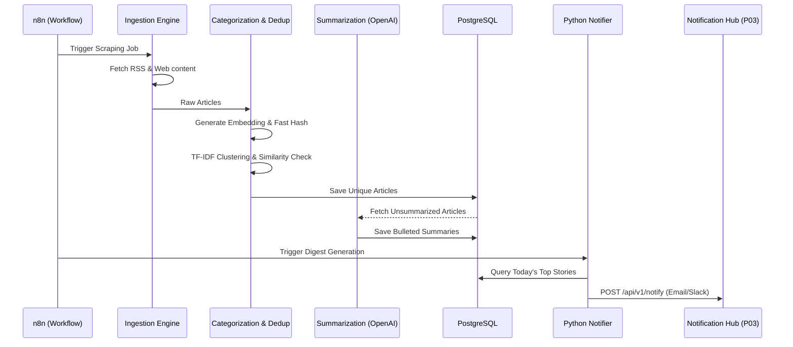

# Project: News Aggregator & Intelligence Reporter

## 1. Problem Statement
Professionals need to stay updated with industry news across dozens of blogs, news sites, and journals. Manually checking these sites is inefficient, and standard RSS readers don't filter out noise, summarize long articles, or detect identical stories covered by different outlets.

This project is an automated intelligence system that aggregates news via RSS and web scraping, categorizes content using NLP, deduplicates cross-source coverage via embedding hashes and Cosine Similarity, summarizes articles using LLMs, and delivers concise, formatted digests via Python integration with a centralized Notification Hub (P03).

## 2. Architecture & Workflow

### 2.1 Workflow Diagram



### 2.2 Tech Stack
*   **Ingestion:** `feedparser` (RSS), Playwright (Dynamic/Paywall JS bypass), `newspaper3k` (Article text extraction)
*   **NLP & Machine Learning:** `scikit-learn` (TF-IDF vectorizer), `pgvector` (Embeddings & Semantic Search)
*   **AI Summarization:** OpenAI API (GPT-4o-mini) or local Ollama (Llama 3)
*   **Database:** PostgreSQL with `pg_trgm` and `pgvector`
*   **Orchestration & Delivery:** n8n, Python Notifier (`requests`), Jinja2 (Templates)
*   **API:** FastAPI

## 3. Core Algorithms

### 3.1 Categorization (TF-IDF)
Articles are categorized (e.g., "AI", "Finance", "Cybersecurity") by matching article content against predefined keyword clusters. 

### 3.2 Scalable Deduplication
When a major event happens, many sites publish the same story.
1. **O(1) Exact Match Hash:** Compute a SHA-256 hash of the title + first 200 characters on insert. Check against existing `content_hash`es.
2. **Semantic Similarity (pgvector):** Pre-compute embeddings for the article. Use a pgvector Cosine Distance query (`<=>`) with a similarity threshold to detect highly similar articles.
3. If similar, link the new article to the parent article and skip LLM summarization.

## 4. Database Schema

```sql
CREATE EXTENSION IF NOT EXISTS pg_trgm;
CREATE EXTENSION IF NOT EXISTS vector;

CREATE TABLE sources (
    id UUID PRIMARY KEY DEFAULT gen_random_uuid(),
    name VARCHAR(100) NOT NULL,
    url TEXT NOT NULL,
    source_type VARCHAR(20), -- 'RSS', 'SCRAPE'
    is_active BOOLEAN DEFAULT TRUE,
    health_status VARCHAR(20) DEFAULT 'HEALTHY',
    last_fetched_at TIMESTAMP WITH TIME ZONE
);

CREATE TABLE categories (
    id UUID PRIMARY KEY DEFAULT gen_random_uuid(),
    name VARCHAR(50) UNIQUE NOT NULL,
    keywords TEXT[] -- Used for TF-IDF matching
);

CREATE TABLE articles (
    id UUID PRIMARY KEY DEFAULT gen_random_uuid(),
    source_id UUID REFERENCES sources(id) ON DELETE SET NULL,
    category_id UUID REFERENCES categories(id) ON DELETE SET NULL,
    title TEXT NOT NULL,
    url TEXT UNIQUE NOT NULL,
    author VARCHAR(100),
    published_date TIMESTAMP WITH TIME ZONE,
    raw_content TEXT,
    content_hash VARCHAR(64), -- Fast exact match (Title + 200 chars)
    embedding vector(1536), -- For semantic deduplication
    ai_summary TEXT, -- Bullet points generated by LLM
    is_duplicate BOOLEAN DEFAULT FALSE,
    parent_article_id UUID REFERENCES articles(id) ON DELETE SET NULL, -- If duplicate
    created_at TIMESTAMP WITH TIME ZONE DEFAULT CURRENT_TIMESTAMP
);

-- Fast Trigram search on titles, full-text on content
CREATE INDEX idx_articles_title_trgm ON articles USING GIN (title gin_trgm_ops);
CREATE INDEX idx_articles_content_fts ON articles USING GIN (to_tsvector('english', raw_content));
CREATE INDEX idx_articles_embedding ON articles USING hnsw (embedding vector_cosine_ops);

CREATE TABLE digests (
    id UUID PRIMARY KEY DEFAULT gen_random_uuid(),
    target_audience VARCHAR(50), -- 'TEAM_SLACK', 'EXEC_EMAIL'
    sent_at TIMESTAMP WITH TIME ZONE DEFAULT CURRENT_TIMESTAMP,
    status VARCHAR(20) -- 'SUCCESS', 'FAILED'
);

-- Join table to track which articles went into which digest
CREATE TABLE digest_articles (
    digest_id UUID REFERENCES digests(id) ON DELETE CASCADE,
    article_id UUID REFERENCES articles(id) ON DELETE CASCADE,
    PRIMARY KEY (digest_id, article_id)
);
```

## 5. API Endpoints

| Method | Endpoint | Description |
| :--- | :--- | :--- |
| `POST` | `/api/v1/sources` | Add a new RSS/Web source |
| `GET` | `/api/v1/sources` | List sources with health status |
| `PUT` | `/api/v1/sources/{id}` | Update a source |
| `DELETE` | `/api/v1/sources/{id}` | Delete a source |
| `GET` | `/api/v1/articles` | Search articles |
| `GET` | `/api/v1/digests` | List past digests |
| `POST` | `/api/v1/digests/generate` | Manually trigger digest generation |

### Example 1: Add a Source (POST `/api/v1/sources`)
**Request:**
```bash
curl -X POST "http://localhost:8000/api/v1/sources" \
     -H "Content-Type: application/json" \
     -d '{
           "name": "TechCrunch",
           "url": "https://techcrunch.com/feed/",
           "source_type": "RSS"
         }'
```
**Response:**
```json
{
  "id": "abc-123",
  "message": "Source added successfully."
}
```

### Example 2: List Sources (GET `/api/v1/sources`)
**Request:**
```bash
curl -X GET "http://localhost:8000/api/v1/sources"
```
**Response:**
```json
[
  {
    "id": "abc-123",
    "name": "TechCrunch",
    "health_status": "HEALTHY",
    "last_fetched_at": "2024-03-01T10:00:00Z"
  }
]
```

### Example 3: Search Articles (GET `/api/v1/articles`)
**Request:**
```bash
curl -X GET "http://localhost:8000/api/v1/articles?category=tech&from=2024-01-01&limit=20"
```
**Response:**
```json
[
  {
    "id": "art-123",
    "title": "New AI Models Released",
    "ai_summary": "- Model X launched.\n- Beats benchmarks.",
    "published_date": "2024-02-15T08:00:00Z"
  }
]
```

### Example 4: List Digests (GET `/api/v1/digests`)
**Request:**
```bash
curl -X GET "http://localhost:8000/api/v1/digests"
```
**Response:**
```json
[
  {
    "id": "dig-123",
    "target_audience": "EXEC_EMAIL",
    "sent_at": "2024-02-15T09:00:00Z",
    "status": "SUCCESS"
  }
]
```

### Example 5: Trigger Digest (POST `/api/v1/digests/generate`)
**Request:**
```bash
curl -X POST "http://localhost:8000/api/v1/digests/generate" \
     -H "Content-Type: application/json" \
     -d '{ "target_audience": "TEAM_SLACK" }'
```
**Response:**
```json
{
  "digest_id": "dig-999",
  "message": "Digest generated and dispatched."
}
```

## 6. Implementation Code Examples

### 6.1 Duplicate Detection (Embedding Search)

```python
import numpy as np

def detect_duplicate(new_embedding: list[float], db_connection, threshold: float = 0.15) -> str:
    """Finds a matching article ID using pgvector cosine distance (<=>)."""
    query = """
        SELECT id, (embedding <=> %s::vector) AS distance 
        FROM articles 
        WHERE embedding IS NOT NULL
        ORDER BY distance ASC 
        LIMIT 1;
    """
    with db_connection.cursor() as cur:
        cur.execute(query, (new_embedding,))
        result = cur.fetchone()
        
    if result and result[1] < threshold:
        return result[0] # Return the matched parent_article_id
    return None
```

### 6.2 HTML Email Template (Jinja2)

```html
<!-- email_template.html -->
<html>
<body style="font-family: Arial, sans-serif;">
    <h2>Daily Intelligence Digest 📰</h2>
    <p>Top stories for {{ date }}</p>

    
        <h3>{{ category }}</h3>
        <ul>
        
            <li>
                <strong><a href="{{ article.url }}">{{ article.title }}</a></strong> (<i>{{ article.source_name }}</i>)<br>
                <div style="color: #555; font-size: 0.9em; margin-top: 5px;">
                    {{ article.ai_summary }}
                </div>
            </li>
        
        </ul>
    
</body>
</html>
```

## 7. Docker Services & File Structure

### 7.1 Services
*   `postgres`: Database with pgvector & pg_trgm.
*   `api`: FastAPI backend.
*   `ingestion_worker`: Celery worker running RSS/Playwright tasks.
*   `redis`: Broker.

### 7.2 File Structure
```text
09-news-aggregator/
├── api/
│   ├── main.py
│   ├── routes.py
├── ingestion/
│   ├── rss_parser.py
│   ├── web_scraper.py
│   └── text_extractor.py
├── intelligence/
│   ├── nlp_processor.py
│   └── llm_summarizer.py
├── delivery/
│   ├── templates/
│   │   └── email_digest.html
│   └── notifier.py
├── db/
│   └── schema.sql
├── docker-compose.yml
└── README.md
```

## 8. Implementation Steps & Testing Strategy

### Implementation Steps:
1.  **Repo skeleton + minimal infra:** create the tree from section 7.2. *Verify:* `docker compose up -d postgres redis` → healthy.
2.  **Schema via plain SQL:** apply tables, including `digest_articles` and pgvector/pg_trgm extensions.
3.  **RSS ingestion:** implement `ingestion/rss_parser.py`.
4.  **Content extraction:** integrate `newspaper3k` to pull clean text.
5.  **Deduplication engine:** implement `content_hash` insertion and `detect_duplicate` pgvector search.
6.  **Categorization:** implement TF-IDF keyword-cluster matching.
7.  **LLM summarization:** implement generic fallback and text dispatch logic via `LLM_PROVIDER`.
8.  **Search API:** implement all CRUD and search endpoints per section 5.
9.  **Delivery automation:** render the Jinja2 template and route HTTP requests to the centralized Notification Hub (P03).
10. **Full stack + smoke test:** run full pipeline and assert digest generation.

### Testing Strategy:
*   **NLP & Vector Tests:** assert deduplicator returns the correct `parent_article_id` for near-matches.
*   **LLM Tests:** ensure timeouts successfully downgrade to raw text extraction rather than failing.
*   **DB Search Performance:** use `EXPLAIN ANALYZE` to ensure indexes are utilized for text queries.

### Environment Variables (.env)
```env
DATABASE_URL=postgresql://user:pass@db:5432/newsdb
OPENAI_API_KEY=sk-your-key
NOTIFICATION_HUB_URL=http://notification-hub:8000
SIMILARITY_THRESHOLD=0.15
LLM_PROVIDER=openai # or 'ollama'
```
