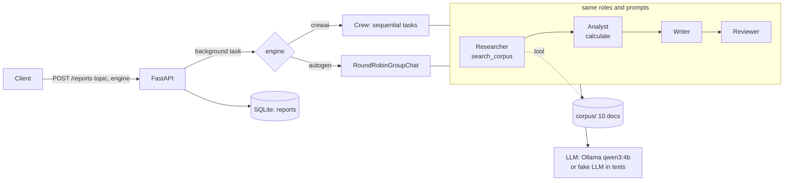

# 17 · Multi-agent research crews: CrewAI vs AutoGen

The same four-agent market-research team built twice, in **CrewAI 1.x** and **AutoGen 0.7 (agentchat)**, behind
one FastAPI service. Give it a topic, get back a structured report whose sources are tracked by the tools (the
model cannot invent them). Runs on a free local model (Ollama) or any OpenAI-compatible endpoint.



## What it shows
- **Two frameworks, one interface:** `crewai_crew.run(topic)` and `autogen_team.run(topic)` both return the same
  `Report` (`title`, `findings`, `sources`, `recommendations`, `markdown`, `llm_calls`, `seconds`).
- **Real tool use:** corpus search (ranked by shared words) and a safe calculator (AST-based: only `+ - * / ( )`,
  so `9**9**99` or `__import__` are rejected instead of hanging or executing).
- **Tested end to end without a model:** a deterministic OpenAI-compatible fake LLM (`fake_llm/server.py`, stdlib
  only) makes both teams really call their tools; 20 tests cover engines, API, validation and failures.
- **Measured comparison**, not opinions: `scripts/compare.py` runs both engines N times and writes
  [docs/COMPARACION.md](docs/COMPARACION.md) (time, LLM calls, complete reports, lines of code).

## Run it
```bash
# Demo stack with the fake LLM (no model needed)
docker compose up -d --build
curl -X POST localhost:8017/reports -H "Content-Type: application/json" \
     -d '{"topic": "demand for AI agents in LATAM", "engine": "crewai"}'    # -> {"id": 1, "status": "pending", ...}
curl localhost:8017/reports/1                                                # -> status completed + report
docker compose down
```

With a real model (Ollama):
```bash
ollama pull qwen3:4b
cp .env.example .env                      # LLM_BASE_URL=http://localhost:11434/v1, LLM_MODEL=qwen3:4b
uv venv -p 3.12 .venv && uv pip install -r requirements-dev.txt
uvicorn app.main:app --port 8017          # or: LLM_BASE_URL=http://host.docker.internal:11434/v1 docker compose up
python scripts/compare.py --runs 3        # measured CrewAI vs AutoGen table
```

## API
| Method | Path | Notes |
|---|---|---|
| `POST` | `/reports` | `{"topic": 3-300 chars, "engine": "crewai" \| "autogen"}` → `202` with the id |
| `GET` | `/reports/{id}` | `status`: `pending` \| `completed` (with `report`) \| `failed` (with `error`) |
| `GET` | `/health` | liveness |


## Tests
```bash
pytest -q        # 20 passed: both engines end to end on the fake LLM, API, tools, report parsing
ruff check .
```

## Next (batch 17-B)
Cloud deployment: Terraform for AWS (ECS Fargate + S3 + SQS) validated against LocalStack, Kubernetes manifests
tested on kind, and CI in GitHub Actions.
