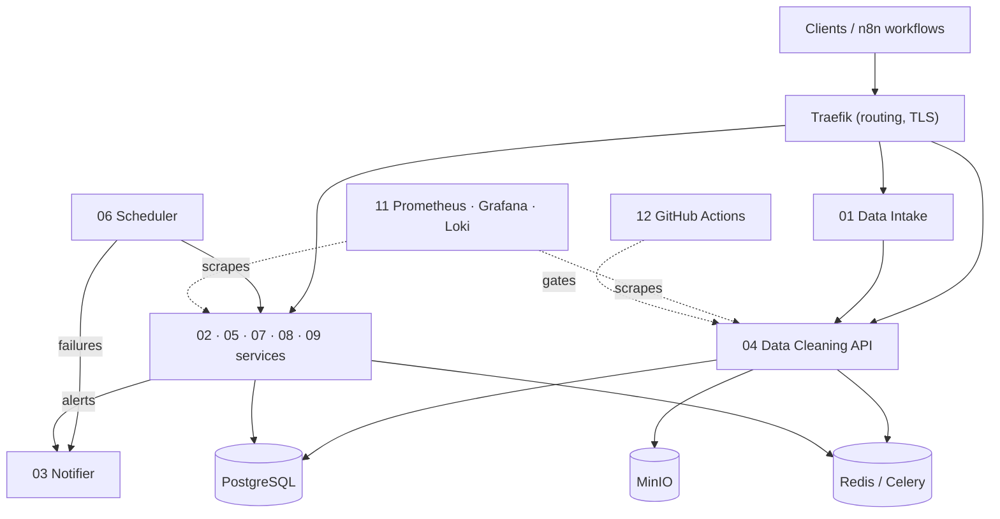

# Automation & Backend Engineering Portfolio

Twelve backend and automation services — data intake, cleaning, notifications, scheduling, OCR,
scraping, observability and CI/CD — designed to run together as one self-hosted production stack.

This README states **what exists today** separately from **what is designed**. A project is
listed as *Implemented* only when it has code and passing tests in CI.

## Current status (2026-09-24)

| #  | Project                                                          | What it does                                                    | Stack                                       | Status      | Evidence                          |
| -- | ---------------------------------------------------------------- | --------------------------------------------------------------- | ------------------------------------------- | ----------- | --------------------------------- |
| 04 | [Data Cleaning API](04-data-cleaning-api/)                       | Cleans, validates and transforms CSV data for no-code workflows | FastAPI, Pandas, Pandera, Celery, MinIO     | Implemented (partial) | 27 tests · 58% cov · CI · [risks](04-data-cleaning-api/docs/RISK-ANALYSIS.md) |
| 10 | [Docker Compose Lab](10-docker-compose-lab/)                     | Shared production topology for all services                     | Docker Compose, Traefik, Postgres, Redis    | Scaffolded  | Backend: 5 tests · 61% cov · CI; compose not yet run end to end |
| 01 | [Smart Data Intake](01-smart-data-intake/)                       | Ingests, validates and routes incoming data for review          | n8n, FastAPI, Postgres, Redis, MinIO        | Designed    | Architecture + build plan         |
| 02 | [Business Registry Enricher](02-business-registry-enricher/)     | Enriches company records from EU business registries            | n8n, FastAPI, Postgres, `aiolimiter`        | Designed    | Architecture + build plan         |
| 03 | [Multi-Channel Notifier](03-multi-channel-notifier/)             | One API to send email / chat / SMS notifications                | FastAPI, Celery, Redis, Jinja2              | Designed    | Architecture + build plan         |
| 05 | [Invoice Processor](05-invoice-processor/)                       | OCR extraction and validation of invoices                       | FastAPI, Tesseract, Celery                  | Designed    | Architecture + build plan         |
| 06 | [Scheduler Engine](06-scheduler-engine/)                         | Cron-style job scheduling with failure alerts                   | FastAPI, Celery Beat, Postgres, Streamlit   | Designed    | Architecture + build plan         |
| 07 | [Price Monitor](07-price-monitor/)                               | Tracks e-commerce prices and alerts on drops                    | Playwright, Celery Beat, FastAPI, Postgres  | Designed    | Architecture + build plan         |
| 08 | [Lead Generator](08-lead-generator/)                             | Scrapes and de-duplicates B2B leads                             | Scraping, `rapidfuzz`, Postgres             | Designed    | Architecture + build plan         |
| 09 | [News Aggregator](09-news-aggregator/)                           | Collects news and produces LLM-summarised reports               | n8n, LLM summarisation, templating          | Designed    | Architecture + build plan         |
| 11 | [Monitoring Dashboard](11-monitoring-dashboard/)                 | Metrics, logs and alerting for the running services             | Prometheus, Grafana, Loki, Alertmanager     | Designed    | Architecture + build plan         |
| 12 | [CI/CD Pipeline](12-ci-cd-pipeline/)                             | Lint, type-check, test, scan and deploy every service           | GitHub Actions, Ruff, Mypy, Pytest          | In progress | [CI workflow](../.github/workflows/portfolio-automation-ci.yml) runs for 04 |

**Status definitions**

- **Implemented** — code exists, tests pass in CI; limits are listed in the project README.
- **Scaffolded** — code exists but is not yet verified by automated tests.
- **Designed** — architecture, API contract, data model and an atomic build checklist
  (`EXECUTION_PLAN.md`); no code yet.

## Target architecture

This diagram is the **target**, not what runs today — see the status table above.



## Quality approach

Borrowed from risk-based quality engineering practice and applied per service:

1. **Risk analysis first.** Each implemented service gets a `docs/RISK-ANALYSIS.md` rating what
   could hurt a user (probability × impact), including defects found in its own code.
2. **Traceability.** `docs/TRACEABILITY-MATRIX.md` maps every risk → scenario → test file.
   Scenarios without a test stay listed as `Not Implemented` rather than disappearing.
3. **Test the real artifact.** API tests import the production app object, so a route missing
   from the deployed service fails CI (this caught a real defect in project 04).
4. **One CI gate per service.** Lint → format → type-check → tests with coverage, with results
   uploaded as artifacts even when a step fails.
5. **Honest claims.** Coverage percentages are reported but not treated as proof of behaviour.

## Roadmap

| Phase | Scope                                                                    | Status      |
| ----- | ------------------------------------------------------------------------ | ----------- |
| 1     | Architecture, API contracts and build plans for all 12 services          | Done        |
| 2     | Project 04 working and gated in CI; risk + traceability model            | Done        |
| 3a    | Project 04: API-key auth, safe errors, config and README contract fixes  | Done        |
| 3b    | Project 04: persisted job state, persisted schemas, Excel/JSON input     | Next        |
| 4     | Build 01 → 03 → 06 → 05 → 02 → 08 → 07 → 09 (order in [`docs/BUILD-PLAN.md`](docs/BUILD-PLAN.md)) | Planned |
| 5     | Monitoring (11), full CI/CD with security scans (12), shared stack (10)  | Planned     |

## Repository layout

```text
NN-project-name/
  README.md           Design: problem, architecture, schema, API, services
  EXECUTION_PLAN.md   Atomic checklist used to build it
  docs/               Risk analysis and traceability (implemented projects)
  app/ tests/         Code and tests (implemented projects)
docs/
  BUILD-PLAN.md       Build order and cross-project decisions
  AI-ASSISTED-DEVELOPMENT.md  How AI tools are used and reviewed here
```

## Running a service

```bash
cd 04-data-cleaning-api
cp .env.example .env            # PowerShell: Copy-Item .env.example .env
pip install -r requirements-dev.txt
pytest --cov                    # unit + API tests, no external services needed
docker compose up -d            # api, worker, db, redis, minio
```
